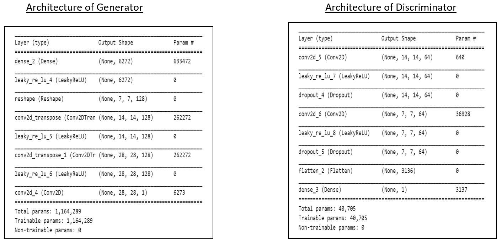
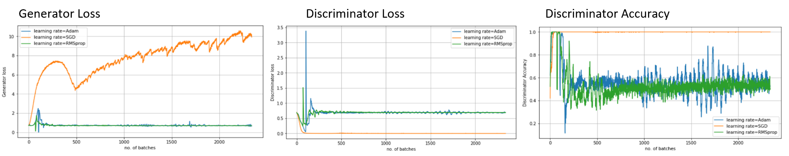
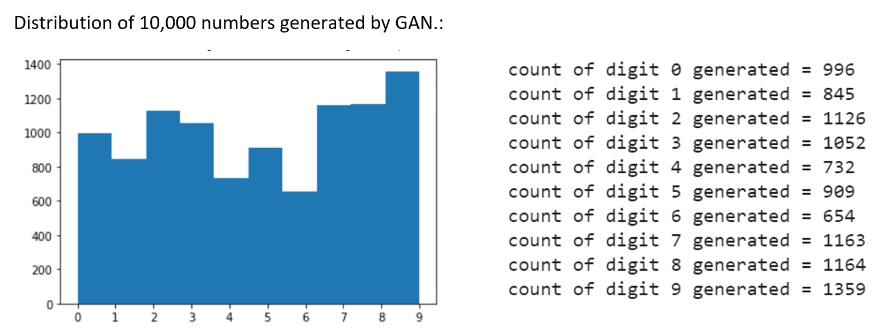

# Generative Adversarial Networks - Training and Observations

[Sample_video.mp4](Sample_video.mp4)

`Set Up`

-Run the .ipynb file and explore the GAN domain!

-The .ipynb was run on Google Colab.

-Dataset: MNIST

`Architecture of Generator and Discriminator`

`Accuracy & Losses`

`Observation`

Discriminator accuracy at first is high, because images generated by generator is not of good quality initially and discriminator can easily classify it as a fake images. However, after generator has been trained, discriminator finds it difficult to classify fake & real images and it’s accuracy oscillates in the region [0.4,0.6].

Also, losses of both generator and discriminator revolves around, 0.6 suggesting that a balance has been reached.

`Playing with Hyperparameters`

*Learning Rate*

For learning rate = 2e-05, the generator never actually learns which means it becomes easy for the discriminator to identify fake samples, hence we can see that discriminator loss decreases to 0 and accuracy spikes up to 1 for discriminator. For learning rate = 0.002, model works fine initially but at the later phase it behaves absurd suggesting that this learning rate is quite high, and the model bounces around local minima. Learning rate = 0.0002 acts as the best learning rate. (For all this learning rate Adam optimizer is used).

*Optimizer*

As we know in general, Adam & RMSprop performs better than SGD, it is also evident in this model. The event which occurred in previous observation, happens in this as well i.e, when generator loss is high, discriminator’s loss is low and it’s accuracy is high. Also we can see that both RMSprop and Adam has a bit of similar performance in Gen. loss and Disc. Loss but the disc. Accuracy varies within a lesser bound than Adam’s suggesting that RMSprop optimizer yields stable results.

`Traversing in Latent Space`

`Distribution of Generated Numbers`

Trained a simple MNIST classifier with test accuracy of 99.07% and predicted outputs of 10,000 fake Generated Images.

We can see that, model is producing more “9” digit and less “6” digit. It might have been possible that while training GAN model was not able to sufficiently distinguish this two digits.
